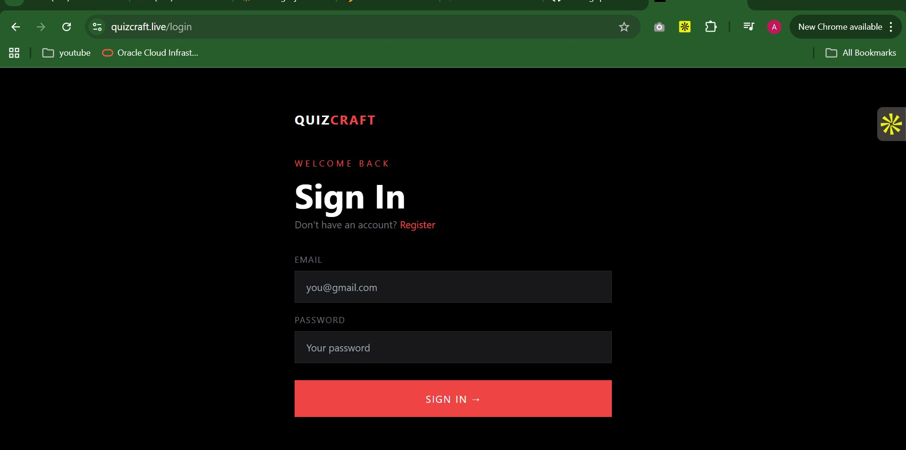
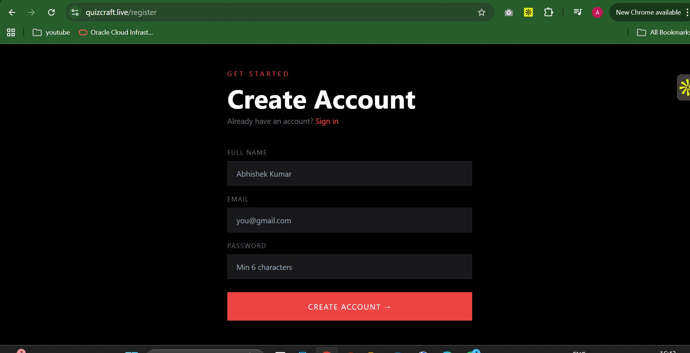
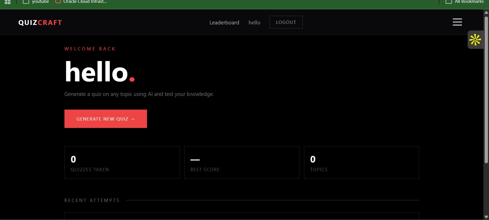
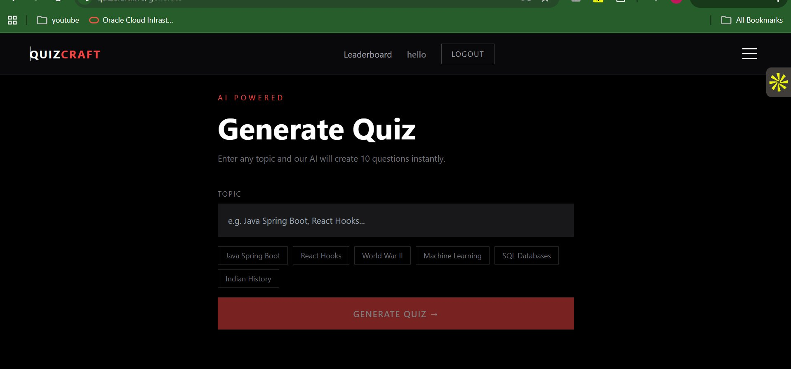
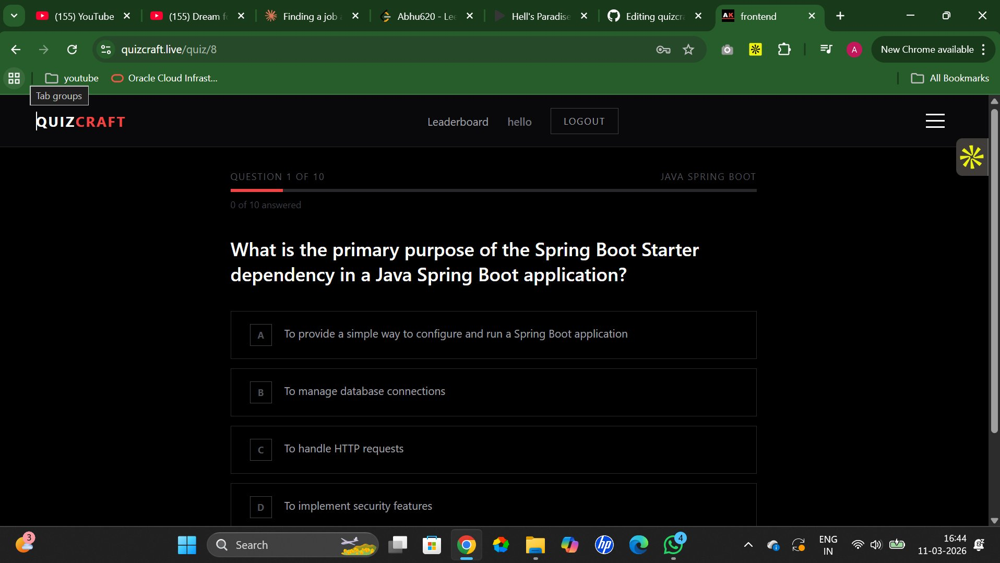
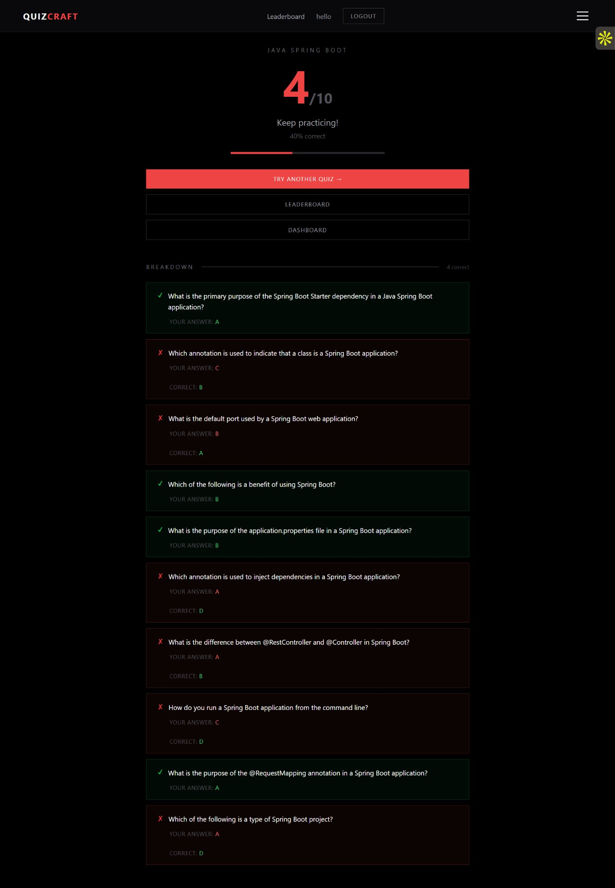
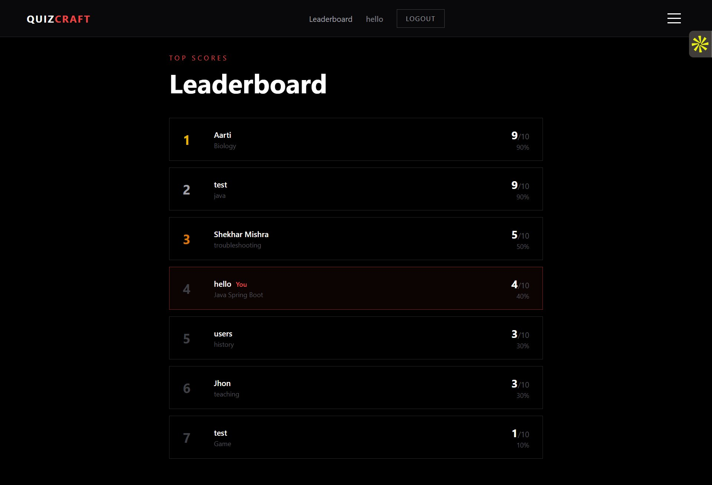
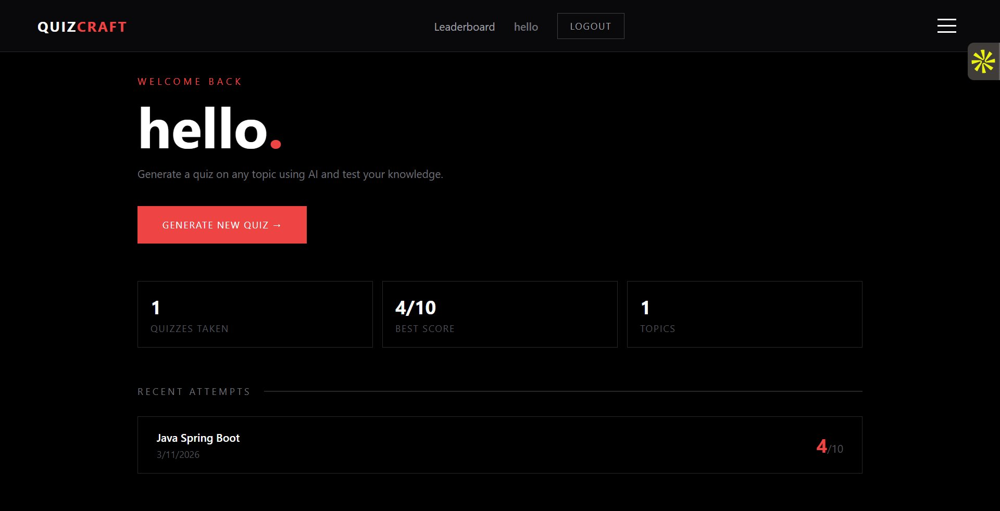

# 🧠 QuizCraft AI

<div align="center">

**Live AI-Powered Quiz SaaS Platform**

[](https://quizcraft.live)
[](https://spring.io/projects/spring-boot)
[](https://aws.amazon.com)
[](https://openai.com)
[](https://docker.com)

*Generate AI-powered quizzes on any topic instantly. Built with a production-grade Java backend, deployed on AWS with 99%+ uptime.*

</div>

---

## 📸 Screenshots

<table>
  <tr>
    <td></td>
    <td></td>
  </tr>
  <tr>
    <td align="center"><b>Login Page</b></td>
    <td align="center"><b>Register Page</b></td>
  </tr>
  <tr>
    <td></td>
    <td></td>
  </tr>
  <tr>
    <td align="center"><b>User Dashboard</b></td>
    <td align="center"><b>AI Quiz Generator</b></td>
  </tr>
  <tr>
    <td></td>
    <td></td>
  </tr>
  <tr>
    <td align="center"><b>Quiz in Progress</b></td>
    <td align="center"><b>Results Breakdown</b></td>
  </tr>
  <tr>
    <td></td>
    <td></td>
  </tr>
  <tr>
    <td align="center"><b>Global Leaderboard</b></td>
    <td align="center"><b>Personal Analytics</b></td>
  </tr>
</table>

---

## ✨ Features

- 🤖 **AI Quiz Generation** — Generates 10 MCQs instantly on any topic using OpenAI API
- 🔐 **JWT Authentication** — Stateless auth with RBAC and BCrypt password hashing
- 📊 **Personal Dashboard** — Quiz history, best scores, and topic tracking per user
- 🏆 **Global Leaderboard** — Real-time ranking across all users
- ⚡ **Token Optimization** — Structured JSON prompting reduces OpenAI token usage by ~30%
- 🌐 **Production Ready** — HTTPS with auto-renewing SSL, 99%+ uptime since launch

---

## 🏗️ Architecture

```
React Frontend (Vercel)
        │
        ▼  HTTPS (443)
   Nginx Reverse Proxy  ◄── SSL via Let's Encrypt
        │
        ▼  Internal (8080)
Spring Boot Backend (Docker · AWS EC2)
        │
   ┌────┴──────────┐
   ▼               ▼
PostgreSQL      OpenAI API
(AWS RDS)      (Structured JSON)
```

---

## 🛠️ Tech Stack

| Layer | Technology |
|---|---|
| **Backend** | Java 17, Spring Boot, Spring MVC, Spring Security |
| **AI** | OpenAI API, Structured JSON Prompt Engineering |
| **Auth** | JWT (Stateless), RBAC, BCrypt |
| **Database** | PostgreSQL · AWS RDS · Spring Data JPA · Hibernate |
| **Cloud** | AWS EC2, AWS RDS, AWS S3 |
| **DevOps** | Docker, Nginx, Let's Encrypt SSL, GitHub Actions |
| **Frontend** | React.js (Vercel) |
| **API Docs** | Swagger / OpenAPI |

---

## 📡 API Endpoints

| Method | Endpoint | Auth | Description |
|---|---|---|---|
| `POST` | `/api/auth/register` | ❌ | Register new user |
| `POST` | `/api/auth/login` | ❌ | Login, receive JWT |
| `POST` | `/api/quiz/generate` | ✅ | Generate AI quiz |
| `GET` | `/api/quiz/history` | ✅ | Get quiz history |
| `POST` | `/api/quiz/{id}/submit` | ✅ | Submit answers |
| `GET` | `/api/leaderboard` | ✅ | Global leaderboard |
| `GET` | `/api/analytics/me` | ✅ | Personal analytics |

---

## ⚙️ Local Setup

```bash
git clone https://github.com/Abhishek-fullstack-dev/quizcraft-ai.git
cd quizcraft-ai/quizcraft-backend
./mvnw spring-boot:run
```

```env
OPENAI_API_KEY=your_key
SPRING_DATASOURCE_URL=jdbc:postgresql://localhost:5432/quizcraft
SPRING_DATASOURCE_USERNAME=your_user
SPRING_DATASOURCE_PASSWORD=your_password
JWT_SECRET=your_secret
```

---

## ☁️ Production Deployment

| Component | Details |
|---|---|
| **EC2** | t2.micro Ubuntu · Dockerized Spring Boot |
| **RDS** | PostgreSQL db.t3.micro · isolated in VPC |
| **Nginx** | Reverse proxy port 443 → 8080 |
| **SSL** | Let's Encrypt · Certbot auto-renewal |
| **Uptime** | 99%+ since January 2026 |

---

## 👤 Author

**Abhishek Kumar** — Java Backend Engineer

[](https://linkedin.com/in/abhishek-kumar-380446233)
[](https://abhishekkumar-dev.vercel.app)
[](https://quizcraft.live)

---

<div align="center"><i>Built and deployed independently — from zero to production on AWS.</i></div>
